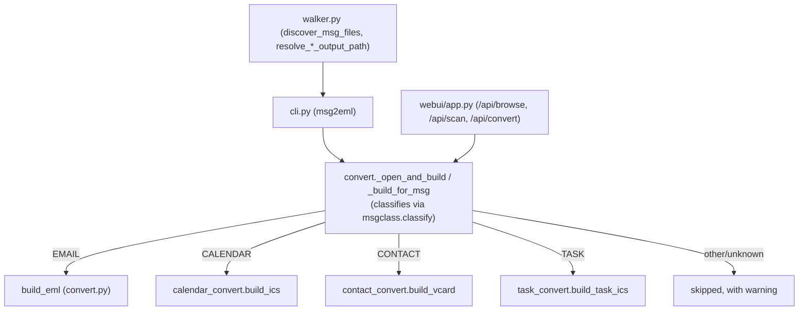

# Architecture

msg2eml converts Outlook `.msg` files into open, standard formats: `.eml`
(RFC 5322/MIME) for email, `.ics` (iCalendar) for calendar items and tasks,
and `.vcf` (vCard) for contacts. There are two entry points — a CLI
(`msg2eml`) and a local Flask web UI (`msg2eml-ui`) — and both funnel
through the same conversion core in `msg2eml.convert`. This document walks
through that core, the four format builders it dispatches to, the
hardening layers each builder relies on, the web UI, and the duck-typed
testing approach that makes the builders fast to test without real `.msg`
files.



## Pipeline and dispatch (`convert.py`, `msgclass.py`, `walker.py`, `cli.py`)

**Classification.** `msg2eml.msgclass.classify()` takes a raw
`PidTagMessageClass` string (e.g. `IPM.Note`, `IPM.Note.SMIME`,
`IPM.Appointment`, `IPM.Schedule.Meeting.Request`, `IPM.Contact`,
`IPM.Task`) and maps it to a `MessageKind` enum member (`EMAIL`,
`CALENDAR`, `CONTACT`, `TASK`, `NOTE`, `POST`, `DISTRIBUTION_LIST`,
`JOURNAL`, `DOCUMENT`, or `UNKNOWN`) via a case-insensitive prefix match
against a fixed list of `(prefix, kind)` tuples. A missing/empty class
string classifies as `UNKNOWN` rather than raising, since some malformed
`.msg` files lack the property entirely.

**Dispatch.** `msg2eml.convert._build_for_msg(msg, warnings, depth)` reads
`msg.classType`, classifies it, and routes to the matching builder:

| `MessageKind` | Builder | Extension |
| --- | --- | --- |
| `EMAIL` | `build_eml` (in `convert.py` itself) | `.eml` |
| `CALENDAR` | `calendar_convert.build_ics` | `.ics` |
| `CONTACT` | `contact_convert.build_vcard` | `.vcf` |
| `TASK` | `task_convert.build_task_ics` | `.ics` |
| anything else | none — skipped with a warning | — |

The result is a frozen `BuildOutput` dataclass carrying `kind`,
`extension`, `maintype`/`subtype`, the built `content: bytes`, and an
optional `email_message: EmailMessage | None`. That last field is only
populated for `EMAIL` output, and exists for exactly one reason: when a
nested `.msg` attachment (a forwarded/attached email) needs to be embedded
in an outer `.eml` as a `message/rfc822` part, it must be attached as the
actual `EmailMessage` object rather than raw bytes. `EmailMessage.add_attachment`
only skips base64-encoding a `message/rfc822` part (per RFC 2046 §5.2.1) when
given a `Message`/`EmailMessage` object — handing it raw bytes would encode
the nested message as an opaque base64 blob instead, which most clients
still parse but which loses the "this is human-readable text, render it
inline" hint. `_add_nested_message()` in `convert.py` is what recurses into
`_build_for_msg()` for an attached `.msg` and picks the `email_message`
vs. `content` path based on whether `output.email_message is not None`.

**Opening a file.** `_open_and_build(source, warnings)` is the shared
helper behind both on-disk and in-memory conversion. Before ever calling
`extract_msg.openMsg()`, it sniffs the first 8 bytes for the OLE2 Compound
File Binary signature (`\xd0\xcf\x11\xe0\xa1\xb1\x1a\xe1`) via
`_looks_like_ole2()`. This exists because handing `extract_msg.openMsg()`
something that isn't a `.msg` file at all — notably a short byte string
that could plausibly be mistaken for a path — produces a confusing raw
`FileNotFoundError` quoting the bytes back verbatim; sniffing the magic
number upfront turns that into one clean `ConversionError` message
instead. `extract_msg`'s own `UnsupportedMSGTypeError` /
`UnrecognizedMSGTypeError` are caught and converted into a skip (not a
failure); any other exception from `extract_msg` propagates to the caller.

**One entry point into the core, shared by both UIs.**
`convert_file(input_path, output_path, force=False)` is disk-based and is
used by both the CLI and the web UI (see below) — there is no separate
in-memory/bytes-based conversion function; both UIs only ever operate on
real files on disk. Because the real output extension (`.eml`/`.ics`/
`.vcf`) isn't known until the source is opened and classified,
`output_path`'s suffix is only a placeholder — `convert_file` swaps it for
the real one via `output_path.with_suffix(f".{output.extension}")` before
writing. It never raises: every failure becomes a `status="failed"`
`ConversionResult` with an `error` string, so a batch run of thousands of
files can't be aborted by one corrupt input.

**CLI and walker.** `cli.py`'s `main()` validates the input path exists
and (for single-file mode) ends in `.msg`, then delegates to `_run()`.
`walker.discover_msg_files(root, recursive)` finds `.msg`/`.MSG`/etc.
files (case-insensitive suffix match, since most Linux/macOS filesystems
are case-sensitive) via `root.glob("**/*" if recursive else "*")`, sorted
for deterministic output. Output-path resolution differs by mode:
- `resolve_single_output_path(input_path, output=...)`: no `-o` → sits
  next to the source (`.with_suffix(".eml")` placeholder); `-o` naming an
  existing directory (or ending in `/`/`\`, since that trailing slash is
  the only signal of "this is a not-yet-created directory" and is
  normalized away the moment the string is wrapped in a `Path`) → that
  directory plus the source's name; anything else → that literal path.
- `resolve_batch_output_path(input_path, *, input_root, output)`: no `-o`
  → next to each source (preserving structure for free); `-o DIR` →
  mirrors the source's path *relative to `input_root`* into `DIR`.

Both return a placeholder `.eml` path; `convert_file` corrects the suffix
once the real kind is known. `cli._convert_one()` wraps output-path
resolution and the actual conversion in one try/except, because resolution
itself can raise (e.g. `Path.relative_to` on a symlinked `.msg` pointing
outside the walked tree) and that must become a per-file `"failed"` result
like any other, not an uncaught exception that kills the rest of a batch.

## Format builders

All four builders share one calling convention: `build_*(msg, *,
warnings=None) -> bytes` (or, for `build_eml`, `-> EmailMessage`, with
`.as_bytes()` called by `_build_for_msg`). `msg` is duck-typed — see
[Testing philosophy](#testing-philosophy-tests) below — and `warnings` is
an in/out list of human-readable strings describing anything imperfect
about the conversion (missing sender, no organizer, recurring event
truncated to one occurrence, etc.), which the CLI surfaces via
`--verbose`/`--json-report`.

**`build_eml`** (in `convert.py`) builds an `EmailMessage` using
`email.policy.default`. It sets headers (`_set_headers`), body
(`_set_body`), and attachments (`_set_attachments`) in that order. Body
selection prefers plain+HTML (as `multipart/alternative`) or whichever one
exists; if neither plain nor HTML text was saved, it falls back to
de-encapsulating the RTF body (see `rtf.py` below), and if that also
fails, to a crude control-word-stripped plain text extraction — the
message is never left with a genuinely empty body if *any* body property
was set. Attachments that are themselves nested `.msg` files are detected
via `attachments.is_nested_message()` and recursively converted (see
above); attachments whose Content-ID is referenced by a `cid:` URL in the
HTML body are attached as inline `multipart/related` parts instead of
plain attachments (`attachments.is_inline_referenced()`); nesting depth is
capped at `_MAX_NESTING_DEPTH = 10` to bound recursion on maliciously or
accidentally self-referential attachment chains.

**`calendar_convert.build_ics`** builds a standalone iCalendar `VEVENT`
covering `IPM.Appointment` and the `IPM.Schedule.Meeting.*` family (both
exposed by `extract_msg` through the same `CalendarBase`-derived property
set). Two design choices are called out explicitly in the module
docstring and worth internalizing before touching this file:
- **It's a standalone `.ics`, not an invite-shaped email** with an
  embedded `text/calendar` MIME part. This is deliberate: Thunderbird's
  plain file-based `.ics` import has no UID/SEQUENCE-aware update logic
  (re-importing an updated `.ics` for the same event creates a duplicate
  rather than updating it), unlike its mail-integrated meeting-invite
  handling. Converting invites to invite-shaped `.eml` is called out as a
  possible, separate future addition.
- **Recurring events export only the master occurrence's start/end time**,
  as a single non-recurring `VEVENT`, with a warning appended. Decoding
  MAPI's internal recurrence-pattern blob into an iCalendar `RRULE` is not
  implemented.

It also derives a UID from `extract_msg`'s Global Object ID
(`cleanGlobalObjectID`, preferred for its stability across a recurring
series, then `globalObjectID`) rather than a random one, maps MAPI
recipient types to iCalendar `ROLE` (organizer excluded from the attendee
list — they're represented via `ORGANIZER` instead), and maps `busyStatus`
to `TRANSPARENT`/`OPAQUE` and event status (`CANCELLED`/`TENTATIVE`/
`CONFIRMED`).

**`contact_convert.build_vcard`** builds a vCard **3.0** document (not
4.0) via `vobject` — 3.0 is the version most broadly supported by mail
clients, including Thunderbird's Address Book, and is what `vobject`
targets. It maps name parts, organization/title, up to three email
addresses, phone numbers (with WORK/HOME/CELL/FAX type params), work/home/
other postal addresses, birthday, photo (base64 `PHOTO;ENCODING=b;TYPE=JPEG`),
and notes/webpage. A warning is appended if the contact has no email
address or phone number at all (still produces a vCard, just flags it as
sparse).

**`task_convert.build_task_ics`** builds a standalone iCalendar `VTODO`
for `IPM.Task`. It maps `taskStatus` (MAPI's `NOT_STARTED`/`IN_PROGRESS`/
`COMPLETE`/`WAITING_ON_OTHER`/`DEFERRED`) onto iCalendar's smaller status
vocabulary (`NEEDS-ACTION`/`IN-PROCESS`/`COMPLETED`, with the two MAPI
values lacking a direct equivalent folding to `NEEDS-ACTION`), and
`importance` (`LOW`/`MEDIUM`/`HIGH`) onto iCalendar's 1–9 `PRIORITY` scale.
UID derivation falls back to a random UUID if `taskGlobalID` is absent —
unlike calendar events, tasks don't go through a multi-party
update/reimport workflow, so UID stability across conversions matters
less here.

## Hardening

**`headers.py`** protects the `.eml` output from header injection and
handles RFC 5322 address formatting. `sanitize_header_value()` strips
embedded CR/LF from any value before it's assigned to a header — every
header value in `convert.py` flows through the single `_set_header()`
chokepoint that calls this, rather than trusting each call site to
remember. This matters because `email.policy.default` raises `ValueError`
outright on a header value containing a raw line break, which would fail
an entire message's conversion over one stray control character in, say,
a subject line pulled from a messy or malicious `.msg` file; folding those
characters to a space instead lets the rest of the conversion proceed.
Separately, `headers.py` reads recipients from `msg.recipients` (structured
MAPI recipient objects with `.name`/`.email`/`.type`) rather than the
semicolon-joined `msg.to`/`.cc`/`.bcc` display strings `extract_msg` also
exposes — those are meant for human eyes, not as an RFC 5322 comma-
separated mailbox list — falling back to the raw strings only when there's
no recipient table at all.

`icalendar` and `vobject` don't need this same treatment: both escape text
values themselves per their respective RFCs (comma/semicolon/backslash/
newline escaping), so `calendar_convert.py`, `contact_convert.py`, and
`task_convert.py` carry no separate injection-hardening layer — this is
called out explicitly in their module docstrings, including a note that
`task_convert.py`'s claim was verified empirically (an embedded newline
renders as a literal `\n` escape sequence, never a raw line break).

**`rtf.py`** de-encapsulates Outlook's Rich Text Format email bodies into
HTML (or plain text) when no plain/HTML body was saved. `extract_msg`
already hands over a "decompressed" `rtfBody`, but `_decompress_if_needed()`
still runs `compressed_rtf.decompress()` defensively — keeping the result
only if it still starts with the RTF magic (`{\rtf`), otherwise falling
back to the original bytes — to protect against edge cases without
depending on `extract_msg` internals staying stable across versions. The
actual de-encapsulation is delegated to `RTFDE.deencapsulate.DeEncapsulator`,
whose Lark-based RTF parser can raise a wide variety of exceptions (both
documented ones and generic ones like `ValueError`/`KeyError`) on RTF it
can't handle; `rtf_to_content()` catches broadly and returns `(None,
None)` on any failure, at which point `convert.py`'s `_set_body()` falls
back to `strip_rtf_controls()` — a crude regex-based control-word stripper
that makes no claim to being a correct RTF renderer, existing purely so a
message whose RTF can't be de-encapsulated still gets *some* readable text
instead of an empty body.

**`attachments.py`** provides shared attachment classification:
`attachment_filename()` (falls back through `name`/`longFilename`/
`shortFilename`/`getFilename()` to a generated `attachment_{index}`, always
sanitized via `sanitize_filename()` which strips filesystem/MIME-unsafe
characters and caps length at 150), `guess_mime_type()` (trusts the
attachment's own `mimetype` if it's well-formed, else guesses from the
filename, else falls back to `application/octet-stream` — also used as a
safety net if the declared MIME type's main/subtype tokens don't look like
valid MIME tokens), `clean_content_id()` (normalizes a raw Content-ID,
rejecting anything containing embedded newlines), `is_inline_referenced()`
(true if a cleaned Content-ID appears as `cid:{cid}` inside the HTML body
— this is what routes an attachment to `add_related` instead of
`add_attachment` in `convert.py`), and `is_nested_message()` (true if the
attachment's `AttachmentType` is `MSG` or `SIGNED_EMBEDDED` — this is what
routes an attachment to `_add_nested_message` instead of being treated as
opaque binary data).

## Web UI

The web UI uses a **local-filesystem folder-browser model**, not a
browser-upload/download one. The reason: browsers never expose a dropped
or selected file's real absolute path to JavaScript or the server (the
File API only exposes a `name`, not a path) — which would make "write the
converted file right next to its source," the CLI's default and most
useful behavior, impossible to replicate with an upload/download design.
Instead, the page lets the user browse and pick folders on their own
machine, and the server converts files in place on disk, exactly like the
CLI does.

It's a Flask app bound to `127.0.0.1` only (never `0.0.0.0` — this is a
local tool, not a service meant to be reachable from the network) with
three JSON API endpoints:

- **`GET /api/browse?path=...`** — lists a directory's immediate
  subfolders and any `.msg` files directly inside it, for in-page folder
  navigation with breadcrumbs.
- **`POST /api/scan`** — recursively walks a chosen folder via
  `msg2eml.walker.discover_msg_files(root, recursive=True)` (the same
  function the CLI's recursive mode uses) and returns every `.msg` file
  found, grouped by its folder path — so a folder with no `.msg` files
  directly inside it, but several nested subfolders that do have them,
  still surfaces everything to the user rather than looking empty.
- **`POST /api/convert`** — takes a list of absolute paths and converts
  each one in place via `msg2eml.convert.convert_file()` — the exact same
  function the CLI calls — writing each output file right next to its
  source. No upload, no download, no base64/Blob machinery anywhere.

As a design note: the two state-changing endpoints (`/api/scan`,
`/api/convert`) only ever accept a JSON body, which doubles as a cheap,
minimal CSRF defense — a plain HTML form can't set `Content-Type:
application/json`, and a cross-origin `fetch` that tries to will be
blocked by the browser's CORS preflight, since this app sends no CORS
headers back. `/api/browse` is a plain read-only `GET`, so the same
concern doesn't apply there; its response is simply unreadable
cross-origin for the same missing-CORS-headers reason. This isn't a
substitute for a real security review, just a cheap property that falls
out of the API shape.

## Testing philosophy (`tests/`)

Every builder module — `build_eml`, `calendar_convert.build_ics`,
`contact_convert.build_vcard`, `task_convert.build_task_ics`, plus the
helpers in `headers.py` and `attachments.py` — is written entirely against
`Any`-typed "parsed message" parameters, touched only via `getattr()`.
None of them ever do `isinstance(msg, extract_msg.Message)` or similar.
This is a deliberate, load-bearing design choice: it means a plain
dataclass exposing the same handful of attributes a real `extract_msg`
object would expose is a fully valid stand-in, with no need to construct
or mock any real `extract_msg` class.

`tests/helpers.py` supplies exactly those stand-ins: `FakeMsg`,
`FakeRecipient`, `FakeAttachment`, `FakeContact`, `FakeTask`, and
`FakeCalendarItem` — plain `@dataclass`es with sensible defaults for every
attribute the corresponding builder reads, plus a no-op `__enter__`/
`__exit__` so they can stand in for `extract_msg.openMsg()`'s context-
manager result too. None of them import `extract_msg` at all.

Concretely, `tests/unit/test_calendar_convert.py` builds an event purely
from a `FakeCalendarItem`:

```python
item = FakeCalendarItem(
    subject="Réunion budget",
    appointmentStartWhole=datetime(2026, 3, 1, 14, 0, tzinfo=timezone.utc),
    appointmentEndWhole=datetime(2026, 3, 1, 15, 0, tzinfo=timezone.utc),
)
warnings: list[str] = []
raw = build_ics(item, warnings=warnings)
```

— no `.msg` file, no `extract_msg` import, and it round-trips through
`icalendar.Calendar.from_ical()` to assert on the parsed `VEVENT`.
Similarly, `tests/unit/test_convert.py` exercises `build_eml()` directly
against `FakeMsg` instances (varying `body`/`htmlBody`/`rtfBody` to hit
the plain/HTML/RTF-fallback/no-body branches) and round-trips the result
through `email.parser.BytesParser` to assert there are no MIME defects.

This keeps the unit suite fast and independent of any real `.msg` binary.
Real `.msg` sample files are only needed for a handful of integration
tests (`tests/integration/`), most notably
`tests/integration/test_real_fixtures.py`, which globs `.msg` files out of
`tests/fixtures/real/` and runs each one through the real `convert_file()`
end to end. That directory is gitignored except for a `.gitkeep`
placeholder (real email/calendar/contact samples routinely contain
personal data, so they're never meant to be committed); when the folder
is empty — a fresh checkout, or CI — `pytest.mark.parametrize` is handed
an empty list, which is pytest's documented mechanism for reporting "no
parameters" as a skip rather than a failure.
